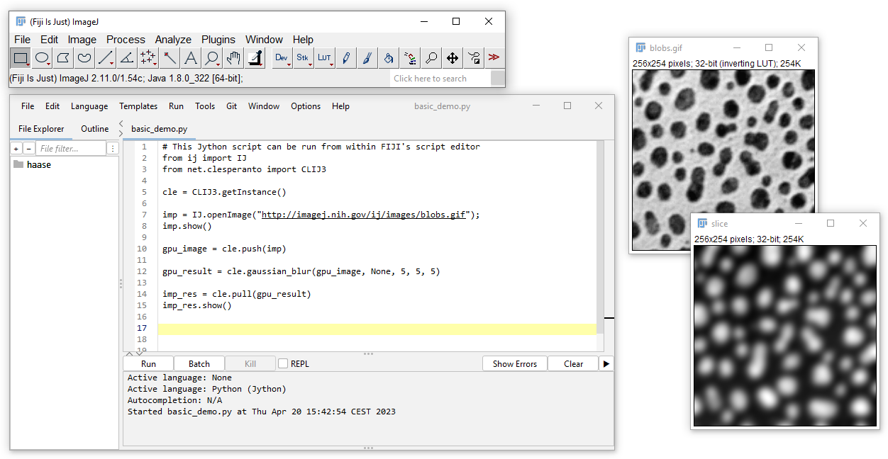

# CLIJ3

clij3 plugin to use clesperanto in the Fiji framework.

This plugin is still in development, feedback are very welcomed!

## Plugin Installation

Download the latest release using the update site `https://imagej.net/clij3` through the Fiji update site system.

## Build and Installation

Clone, and build the project using maven: `mvn install`.

Configure the `pom` file to specify the path to your local Fiji ([here](https://github.com/clEsperanto/clij3/blob/95560c3e8a2173e65d1f56c827cf42787ad03a96/pom.xml#L71))
Run `mvn install` to install the plugin to your Fiji.
Afterwards, you can execute example scripts like [this one](https://github.com/clEsperanto/clij3/blob/95560c3e8a2173e65d1f56c827cf42787ad03a96/demo/basic_demo.py) in your Fiji.

## Acknowledgements

We acknowledge support by the Deutsche Forschungsgemeinschaft under Germany’s Excellence Strategy (EXC2068) Cluster of Excellence Physics of Life of TU Dresden.
This project has been made possible in part by grant number 2021-237734 ([GPU-accelerating Fiji and friends using distributed CLIJ, NEUBIAS-style, EOSS4](https://chanzuckerberg.com/eoss/proposals/gpu-accelerating-fiji-and-friends-using-distributed-clij-neubias-style/)) from the Chan Zuckerberg Initiative DAF, an advised fund of the Silicon Valley Community Foundation.

